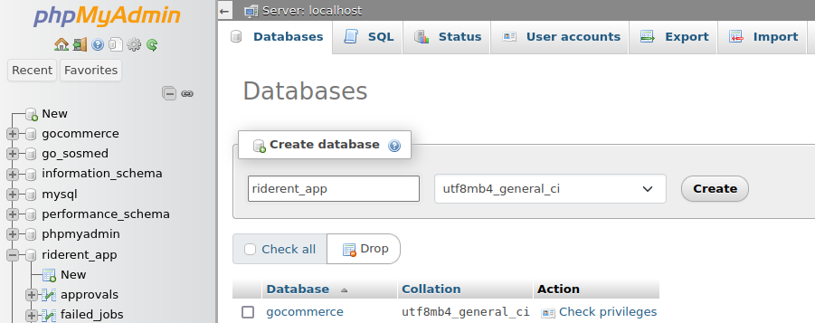

# RideRent App (Aplikasi Pemesanan Kendaraan)

Aplikasi ini digunakan untuk melakukan pemesanan kendaraan dengan beberapa fitur utama, termasuk manajemen pemesanan, persetujuan berjenjang, dashboard grafik pemakaian kendaraan, dan laporan pemesanan yang dapat diexport dalam format Excel.

## Daftar Isi

- [Informasi Proyek](#informasi-proyek)
- [Persyaratan Sistem](#persyaratan-sistem)
- [Instalasi](#instalasi)
- [Penggunaan](#penggunaan)
- [Daftar Username-Password](#daftar-username-password)
- [Framework](#framework)
- [File Pendukung](#file-pendukung)
- [Author](#Author)

## Informasi Proyek

Aplikasi ini dibangun untuk memudahkan proses pemesanan kendaraan dengan fitur-fitur yang mencakup manajemen pemesanan, persetujuan berjenjang, dan pelaporan.

## Persyaratan Sistem

- PHP 7.0 - 8.0.
- MySQL atau database relasional lainnya (XAMPP/LAMPP).
- Web server (contoh: Apache).
- Browser web modern (Chrome/Firefox).
- Composer
- NodeJS versi  >= 16
- Angular CLI versi >= 16

## Instalasi

Membuka terminal lalu
Clone repositori ini ke dalam direktori komputer anda

### Backend
- `cd backend`
- `composer install atau composer update` 
- `cp .env.example .env`
- `php artisan key:generate`
- silahkan membuat database dengan contoh
  
- `php artisan migrate --seed`
- `php artisan serve`

### Frontend
- buka dengan beda terminal (cmd/powershell)
- `cd frontend`
- `npm install -g @angular/cli`
- setelah install angular cli coba cek dengan
  `ng version`
- `npm install`
- `ng serve --open`

## Penggunaan

1. Akses aplikasi melalui browser dengan [http://localhost:4200](http://localhost:4200)
2. Login menggunakan akun admin atau pihak yang menyetujui.
3. Gunakan menu untuk melakukan pemesanan, persetujuan, dan melihat laporan.

## Daftar Username-Password

| Email             | Password    | Role   |
| ----------------- | ----------- | ------ |
| admin@gmail.com    | password    | Admin  |
| user@gmail.com     | password    | User   |

## Framework

Aplikasi ini menggunakan kombinasi Laravel sebagai backend dan Angular sebagai frontend untuk memastikan kehandalan, keamanan, dan antarmuka pengguna yang responsif.

### Backend (Laravel)
- Framework: Laravel
- Versi Laravel: 8.0
- Dokumentasi Laravel: https://laravel.com/docs/8.x
### Frontend (Angular)
- Framework: Angular
- Versi Angular: 15
- Dokumentasi Angular: https://angular.io/docs

pastikan sudah menjalankan backend
- Api Postman dapat dilihat pada folder /doc/postman/*
- User Case Diagram  
  
- Struktur Data Konsep  
  
  

## Author

Firgi Sotya Izzuddin | 2024